<picture>
  <source media="(prefers-color-scheme: dark)" srcset="assets/hero-dark.svg" />
  
</picture>

<picture>
  <source media="(prefers-color-scheme: dark)" srcset="assets/sec-about-dark.svg" />
  
</picture>

I started at **1337** (42 Network), writing memory allocators, shells, thread-synchronised simulations and network servers from scratch in C and C++, with no external libraries. That's where I learned how memory, processes and sockets really behave.

Since then I founded **[Cagrex](https://cagrex.com)**, a developer-assessment platform I built alone end to end, shipped AI features to production as a full-stack developer at **Lysi Consulting**, and freelance on Upwork. Right now I'm building mobile games with Godot and Unity.

<picture>
  <source media="(prefers-color-scheme: dark)" srcset="assets/sec-work-dark.svg" />
  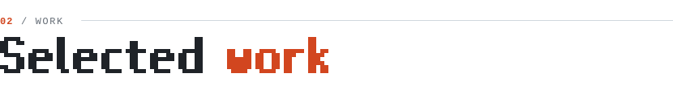
</picture>

<a href="https://play.google.com/store/apps/details?id=com.leap2joy.murmur">
<picture>
  <source media="(prefers-color-scheme: dark)" srcset="assets/work-flockfall-dark.svg" />
  
</picture>
</a>
<a href="https://cagrex.com">
<picture>
  <source media="(prefers-color-scheme: dark)" srcset="assets/work-cagrex-dark.svg" />
  
</picture>
</a>
<a href="https://github.com/yuxev/ft_transcendence">
<picture>
  <source media="(prefers-color-scheme: dark)" srcset="assets/work-ft_transcendence-dark.svg" />
  
</picture>
</a>
<a href="https://github.com/yuxev/smalloc">
<picture>
  <source media="(prefers-color-scheme: dark)" srcset="assets/work-smalloc-dark.svg" />
  
</picture>
</a>
<a href="https://github.com/yuxev/SyncMaster">
<picture>
  <source media="(prefers-color-scheme: dark)" srcset="assets/work-syncmaster-dark.svg" />
  
</picture>
</a>
<a href="https://github.com/yuxev/cub3d">
<picture>
  <source media="(prefers-color-scheme: dark)" srcset="assets/work-cub3d-dark.svg" />
  
</picture>
</a>
<a href="https://github.com/yuxev/multithreading-downloader">
<picture>
  <source media="(prefers-color-scheme: dark)" srcset="assets/work-downloader-dark.svg" />
  
</picture>
</a>

<picture>
  <source media="(prefers-color-scheme: dark)" srcset="assets/sec-experience-dark.svg" />
  
</picture>

<picture>
  <source media="(prefers-color-scheme: dark)" srcset="assets/experience-dark.svg" />
  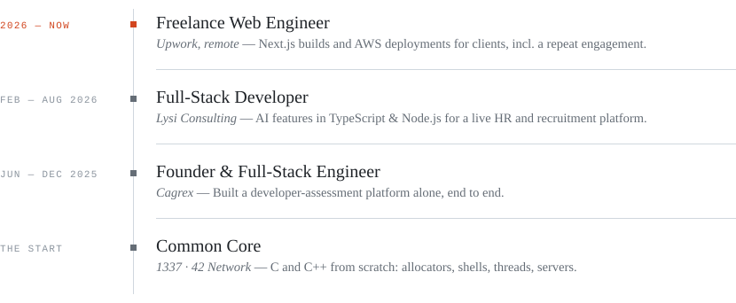
</picture>

<picture>
  <source media="(prefers-color-scheme: dark)" srcset="assets/sec-toolbox-dark.svg" />
  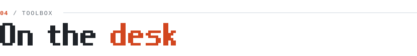
</picture>

<picture>
  <source media="(prefers-color-scheme: dark)" srcset="assets/toolbox-dark.svg" />
  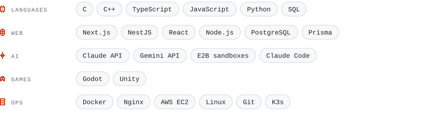
</picture>

<a href="mailto:adilasselman137@gmail.com">
<picture>
  <source media="(prefers-color-scheme: dark)" srcset="assets/contact-dark.svg" />
  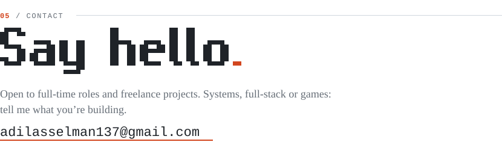
</picture>
</a>

**[Email](mailto:adilasselman137@gmail.com)** &nbsp;·&nbsp; **[Cagrex](https://cagrex.com)** &nbsp;·&nbsp; **[Flockfall on Google Play](https://play.google.com/store/apps/details?id=com.leap2joy.murmur)**

<picture>
  <source media="(prefers-color-scheme: dark)" srcset="assets/footer-dark.svg" />
  
</picture>
